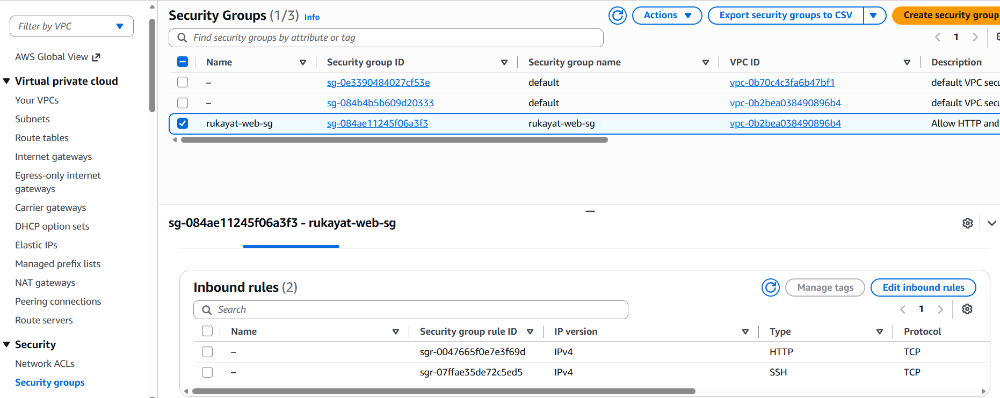
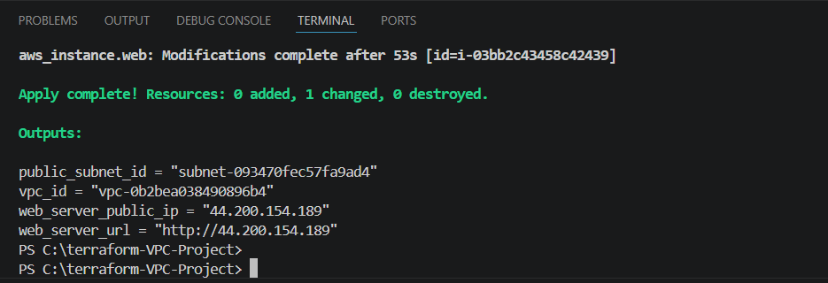
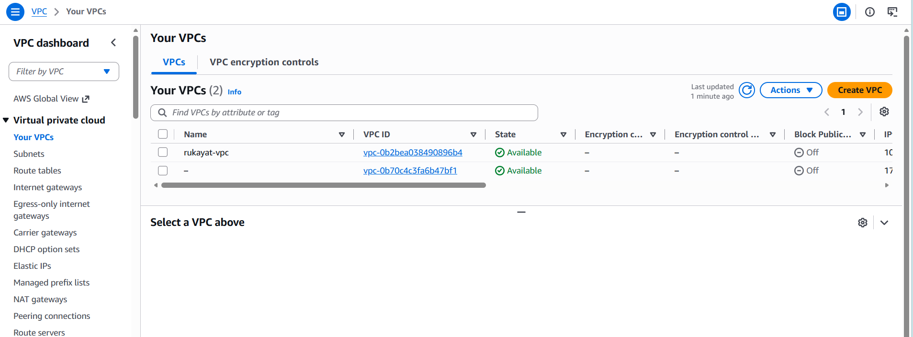
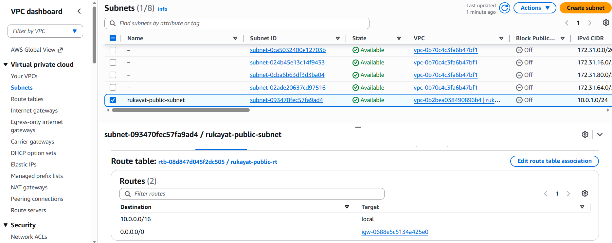
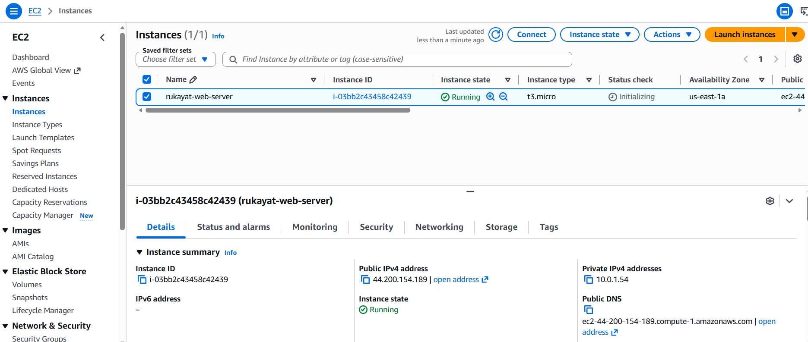
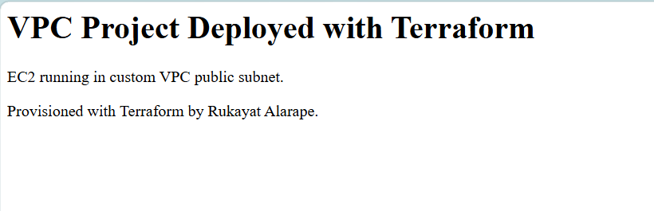
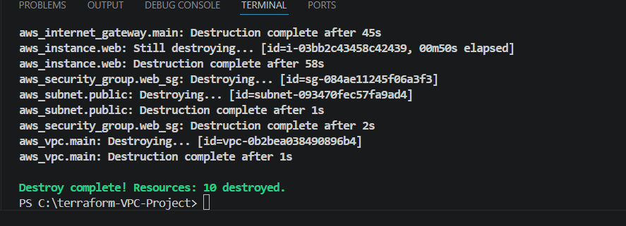

# Terraform — Custom AWS VPC with EC2 Web Server


A custom AWS Virtual Private Cloud (VPC) with public and private subnets, an internet gateway, route tables, and a live EC2 web server — all provisioned with Terraform. No clicking through the console. One command builds the entire network stack from scratch.

> **"A complete, production-style AWS network — defined as code and deployed in minutes."**

---

## Architecture


---

## What Terraform Provisions

| Terraform Resource | AWS Service | Purpose |
|---|---|---|
| `aws_vpc` | Amazon VPC | Private isolated network — 10.0.0.0/16 |
| `aws_subnet` (public) | Amazon VPC | Public subnet 10.0.1.0/24 — EC2 lives here |
| `aws_subnet` (private) | Amazon VPC | Private subnet 10.0.2.0/24 — for databases/internal services |
| `aws_internet_gateway` | Amazon VPC | Door between the VPC and the internet |
| `aws_route_table` (public) | Amazon VPC | Routes internet traffic to the IGW |
| `aws_route_table` (private) | Amazon VPC | Internal only — no internet route |
| `aws_route_table_association` (×2) | Amazon VPC | Links each subnet to its route table |
| `aws_security_group` | Amazon EC2 | Firewall — allows HTTP (80) and SSH (22) inbound |
| `aws_instance` | Amazon EC2 | Web server running nginx in the public subnet |

**Total: 11 resources provisioned by one `terraform apply`**

---

## Project Structure

```
terraform-aws-vpc/
├── provider.tf         # AWS provider and region configuration
├── variables.tf        # Reusable values — project name, CIDR blocks
├── main.tf             # All 11 AWS resources defined as code
├── outputs.tf          # Prints VPC ID, subnet ID, and web server IP after apply
└── .gitignore          # Excludes state files and .terraform/ folder
```

---

## How to Use This Project

### Prerequisites
- [Terraform installed](https://developer.hashicorp.com/terraform/install) (AMD64 for Windows)
- [AWS CLI installed](https://aws.amazon.com/cli/) and configured (`aws configure`)
- An AWS IAM user with AdministratorAccess

### Deploy

```bash
# 1. Clone the repo
git clone https://github.com/rukkylatunde2001/terraform-aws-vpc.git
cd terraform-aws-vpc

# 2. Initialise Terraform
terraform init

# 3. Preview what will be created
terraform plan

# 4. Build all 11 resources
terraform apply
```

After apply, Terraform prints the public IP. Visit `http://[public-ip]` in your browser to see the live web page.

### Destroy

```bash
terraform destroy
```

All 11 resources deleted cleanly in one command.

---

## How It Was Built — Step by Step

### Step 1 — Define Variables

Created `variables.tf` to store reusable values — project name and CIDR blocks. This means changing one value automatically updates every resource name and network range across all files.

```hcl
variable "project_name"        { default = "rukayat" }
variable "vpc_cidr"            { default = "10.0.0.0/16" }
variable "public_subnet_cidr"  { default = "10.0.1.0/24" }
variable "private_subnet_cidr" { default = "10.0.2.0/24" }
```

---

### Step 2 — Create the VPC

The VPC is the foundation — a private, isolated network inside AWS. Everything else lives inside it. CIDR block `10.0.0.0/16` gives up to 65,536 private IP addresses across all subnets.

`enable_dns_hostnames = true` was added so EC2 instances receive a public DNS hostname alongside their IP address — required for some services to function correctly.

---

### Step 3 — Create Public and Private Subnets

Two subnets divide the VPC into zones:

- **Public subnet (10.0.1.0/24)** — has a route to the internet. The EC2 web server lives here. `map_public_ip_on_launch = true` automatically assigns a public IP to any instance launched here.
- **Private subnet (10.0.2.0/24)** — no internet route. Reserved for internal resources like databases that should not be publicly accessible.

The difference between public and private is not in the subnet itself — it is in the **route table** attached to it.

---

### Step 4 — Create the Internet Gateway and Route Tables

The Internet Gateway (IGW) is the bridge between the VPC and the internet. Without it, nothing inside the VPC can communicate with the outside world.

Two route tables were created:
- **Public route table** — contains the rule `0.0.0.0/0 → IGW`, which sends all internet-bound traffic through the gateway
- **Private route table** — no internet route, traffic stays inside the VPC

Each subnet was associated with its respective route table. This association is what makes a subnet public or private.

---

### Step 5 — Create the Security Group

The security group acts as a virtual firewall for the EC2 instance, controlling what traffic is allowed in and out.

Inbound rules:
- **Port 80 (HTTP)** — allows anyone to visit the website
- **Port 22 (SSH)** — allows terminal access to the server

Outbound: all traffic allowed.



---

### Step 6 — Launch the EC2 Instance

An EC2 instance was launched in the public subnet using the latest Amazon Linux 2023 AMI — retrieved automatically using a `data` source so no manual AMI ID lookup is needed.

The instance uses a `user_data` script to install nginx and serve a custom HTML page on first boot. Instance type is `t2.micro` (free tier eligible).

---

### Step 7 — terraform apply

After reviewing the plan (`11 to add, 0 to change, 0 to destroy`), ran `terraform apply` and confirmed with `yes`.



---

### Step 8 — Verify in AWS Console

**VPC created:**



**Public subnet associated with route table pointing to IGW:**



**EC2 instance running in the public subnet:**



---

### Step 9 — Live Web Page

With nginx running on the EC2 instance, visiting the public IP on port 80 loaded the live web page — confirming the entire network stack works end to end.



**The full chain that makes this work:**
```
Browser → Internet → Internet Gateway → Route Table (0.0.0.0/0 → IGW)
→ Public Subnet → Security Group (port 80 allowed) → EC2 → nginx → Web page
```

---

### Step 10 — terraform destroy

After verifying everything worked, all 11 resources were destroyed with one command — no manual cleanup in the console required.



---

## Key Concepts Demonstrated

| Concept | How It Was Applied |
|---|---|
| **VPC** | Custom isolated network with a defined CIDR range |
| **Public vs Private Subnet** | Separation of internet-facing and internal resources |
| **Internet Gateway** | Connects the VPC to the public internet |
| **Route Tables** | Control where network traffic is directed |
| **Security Groups** | Instance-level firewall — port 80 and 22 inbound |
| **Infrastructure as Code** | All 11 resources defined in .tf files, zero console clicking |
| **Terraform Variables** | Reusable values across all resource definitions |
| **Terraform Outputs** | Public IP printed automatically after apply |

---

## Troubleshooting

**`ERR_CONNECTION_REFUSED` when visiting the web page**
The browser may be using `https://` automatically. I type `http://` manually — we only opened port 80, not 443.

**IP address changes after every `terraform apply`**
EC2 public IPs are dynamic and change when an instance is recreated. Add an `aws_eip` (Elastic IP) resource to assign a fixed IP that persists across recreations.

**user_data script doesn't run on recreated instances**
cloud-init only runs user_data on the very first boot of a brand new instance. If Terraform destroys and recreates an instance, cloud-init may skip it. Connect via EC2 Instance Connect and install nginx manually if needed.

---

## About the Author

**Rukayat Alarape**
Data Analyst | Cloud Engineer | DevOps 

- GitHub: [@rukkylatunde2001](https://github.com/rukkylatunde2001)
- Email: rukkylatunde2001@gmail.com
